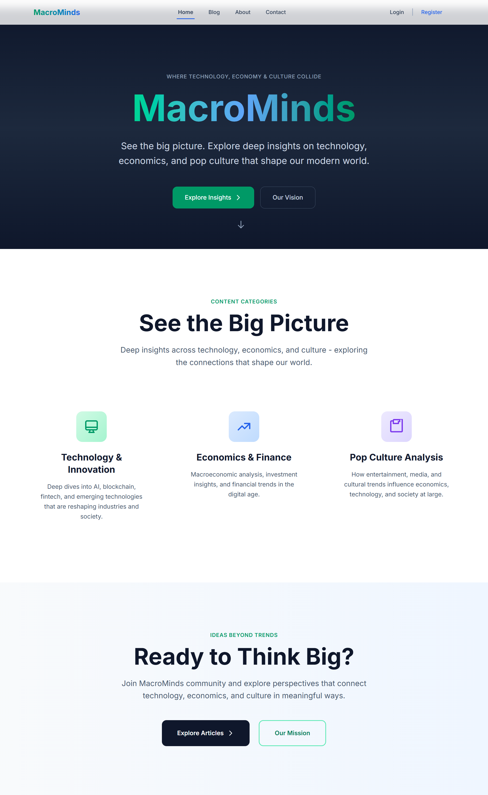
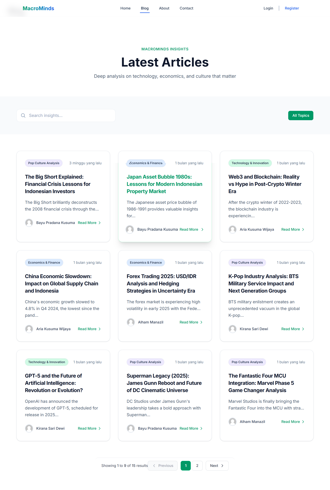
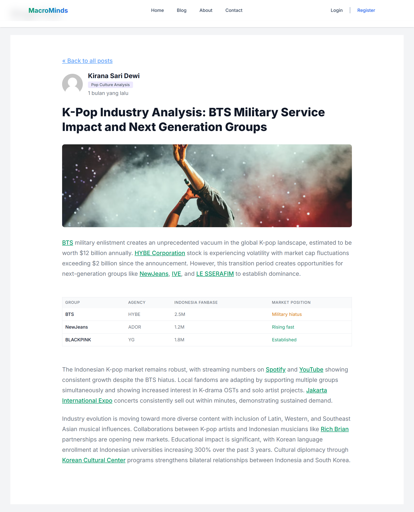

<p align="center">
    
</p>

<h1 align="center">MacroMinds</h1>

<p align="center">
    <em>Ideas Beyond Trends - Where Technology, Economics, and Culture Converge</em>
</p>

<p align="center">
<a href="https://packagist.org/packages/laravel/framework"></a>
<a href="https://opensource.org/licenses/MIT"></a>
</p>

## About MacroMinds

MacroMinds is a modern blog platform built with Laravel that explores the interconnected relationships between technology, economics, and popular culture. We provide deep analysis and global perspectives on emerging trends, helping readers understand the bigger picture beyond surface-level news.

### Content Pillars

-   **🚀 Technology & Innovation**: Exploring breakthrough technologies like AI, quantum computing, and blockchain that reshape our digital future
-   **📈 Economics & Finance**: Analyzing global markets, cryptocurrency trends, and economic patterns that drive worldwide change
-   **🎭 Pop Culture Analysis**: Understanding how entertainment, media, and cultural movements influence society and economy

### Features

-   **Modern Design**: Clean, professional interface with emerald green branding
-   **Responsive Layout**: Optimized for desktop, tablet, and mobile devices
-   **Rich Content**: Support for images, tables, and multimedia content
-   **Category System**: Organized content across three main pillars
-   **SEO Optimized**: Built with search engine optimization in mind
-   **Fast Performance**: Leveraging Laravel's robust framework for optimal speed

## Technology Stack

MacroMinds is built using modern web technologies:

-   **Backend**: Laravel 12.x (PHP 8.4+)
-   **Frontend**: Tailwind CSS, Alpine.js
-   **Database**: SQLite (development), MySQL/PostgreSQL (production)
-   **Assets**: Vite for modern asset compilation
-   **Authentication**: Laravel Breeze
-   **Testing**: Pest PHP

## Installation & Setup

### Prerequisites

-   PHP 8.4 or higher
-   Composer
-   Node.js & NPM
-   SQLite (for development)

### Quick Start

1. **Clone the repository**

    ```bash
    git clone https://github.com/Alhammanazil/MacroMinds.git
    cd MacroMinds
    ```

2. **Install dependencies**

    ```bash
    composer install
    npm install
    ```

3. **Environment setup**

    ```bash
    cp .env.example .env
    php artisan key:generate
    ```

4. **Database setup**

    ```bash
    php artisan migrate:fresh --seed
    ```

5. **Start development server**

    ```bash
    php artisan serve
    npm run dev
    ```

6. **Visit your application**
   Open [http://localhost:8000](http://localhost:8000) in your browser

## Project Structure

```
wpublog/
├── app/
│   ├── Http/Controllers/     # Application controllers
│   ├── Models/              # Eloquent models
│   └── Policies/           # Authorization policies
├── database/
│   ├── migrations/         # Database migrations
│   ├── seeders/           # Database seeders
│   └── factories/         # Model factories
├── resources/
│   ├── views/             # Blade templates
│   ├── css/              # Stylesheets
│   └── js/               # JavaScript files
└── routes/               # Application routes
```

## Screenshots

### Homepage
The homepage features a modern hero section with gradient background and clear navigation to explore the three main content categories.



### Blog Posts Page
Browse through our collection of articles organized by categories - Technology & Innovation, Economics & Finance, and Pop Culture Analysis.



### Article Detail Page
Individual articles feature clean typography, author information, and engaging content with multimedia support.




## Content Management

The blog features a comprehensive seeding system that populates the database with:

-   **15 Professional Articles**: 5 articles each across Technology, Economics, and Pop Culture
-   **Rich Media Content**: Articles include Unsplash images and data tables
-   **Author Profiles**: Indonesian authors with professional backgrounds
-   **Category System**: Color-coded categories with icons

## Deployment

### Production Checklist

-   [ ] Set `APP_ENV=production` in `.env`
-   [ ] Configure production database
-   [ ] Set up proper web server (Nginx/Apache)
-   [ ] Configure SSL certificate
-   [ ] Set up backup system
-   [ ] Configure monitoring

## Acknowledgments

-   **Laravel Team**: For the excellent framework
-   **Tailwind CSS**: For the utility-first CSS framework
-   **Unsplash**: For high-quality stock photography
-   **WPU Course Community**: For inspiration and support

## License

This project is open-sourced software licensed under the [MIT license](https://opensource.org/licenses/MIT).

## Support

If you found this project helpful, please consider:

-   ⭐ Starring the repository
-   🐛 Reporting bugs
-   💡 Suggesting new features
-   📝 Contributing to documentation

---

<p align="center">
    <strong>MacroMinds</strong> - Connecting the dots in a complex world
</p>
